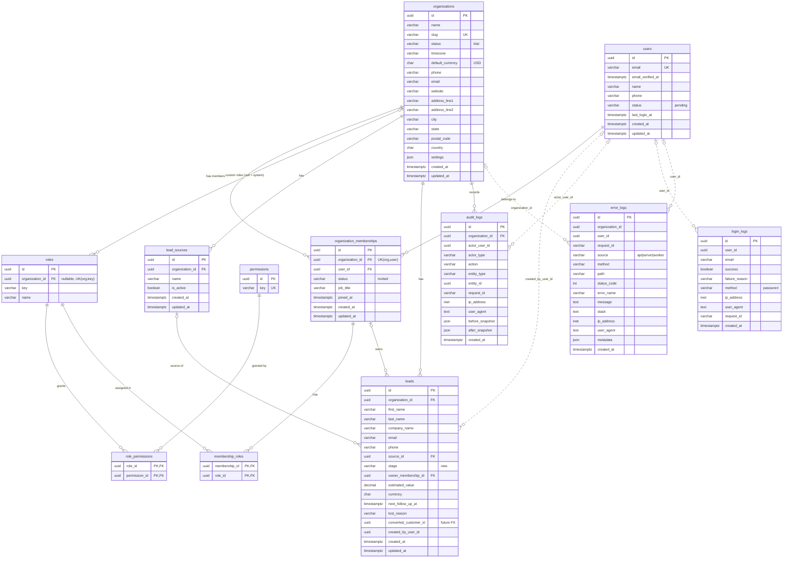

# Database ER Diagram

Source: `prisma/schema.prisma`. Solid lines are real foreign keys; dotted lines are logical references (uuid column, no FK constraint yet).

```mermaid
erDiagram
    organizations ||--o{ organization_memberships : "has members"
    users ||--o{ organization_memberships : "belongs to"
    organizations |o--o{ roles : "custom roles (null = system)"
    roles ||--o{ role_permissions : grants
    permissions ||--o{ role_permissions : "granted by"
    organization_memberships ||--o{ membership_roles : has
    roles ||--o{ membership_roles : "assigned in"
    organizations ||--o{ lead_sources : has
    organizations ||--o{ leads : has
    lead_sources |o--o{ leads : "source of"
    organization_memberships |o--o{ leads : owns
    organizations ||--o{ audit_logs : records

    users |o..o{ leads : "created_by_user_id"
    users |o..o{ audit_logs : "actor_user_id"
    users |o..o{ login_logs : "user_id"
    users |o..o{ error_logs : "user_id"
    organizations |o..o{ error_logs : "organization_id"

    organizations {
        uuid id PK
        varchar name
        varchar slug UK
        varchar status "trial"
        varchar timezone
        char default_currency "USD"
        varchar phone
        varchar email
        varchar website
        varchar address_line1
        varchar address_line2
        varchar city
        varchar state
        varchar postal_code
        char country
        json settings
        timestamptz created_at
        timestamptz updated_at
    }
    users {
        uuid id PK
        varchar email UK
        timestamptz email_verified_at
        varchar name
        varchar phone
        varchar status "pending"
        timestamptz last_login_at
        timestamptz created_at
        timestamptz updated_at
    }
    organization_memberships {
        uuid id PK
        uuid organization_id FK "UK(org,user)"
        uuid user_id FK
        varchar status "invited"
        varchar job_title
        timestamptz joined_at
        timestamptz created_at
        timestamptz updated_at
    }
    roles {
        uuid id PK
        uuid organization_id FK "nullable, UK(org,key)"
        varchar key
        varchar name
    }
    permissions {
        uuid id PK
        varchar key UK
    }
    role_permissions {
        uuid role_id PK,FK
        uuid permission_id PK,FK
    }
    membership_roles {
        uuid membership_id PK,FK
        uuid role_id PK,FK
    }
    lead_sources {
        uuid id PK
        uuid organization_id FK
        varchar name
        boolean is_active
        timestamptz created_at
        timestamptz updated_at
    }
    leads {
        uuid id PK
        uuid organization_id FK
        varchar first_name
        varchar last_name
        varchar company_name
        varchar email
        varchar phone
        uuid source_id FK
        varchar stage "new"
        uuid owner_membership_id FK
        decimal estimated_value
        char currency
        timestamptz next_follow_up_at
        varchar lost_reason
        uuid converted_customer_id "future FK"
        uuid created_by_user_id
        timestamptz created_at
        timestamptz updated_at
    }
    audit_logs {
        uuid id PK
        uuid organization_id FK
        uuid actor_user_id
        varchar actor_type
        varchar action
        varchar entity_type
        uuid entity_id
        varchar request_id
        inet ip_address
        text user_agent
        json before_snapshot
        json after_snapshot
        timestamptz created_at
    }
    error_logs {
        uuid id PK
        uuid organization_id
        uuid user_id
        varchar request_id
        varchar source "api|server|worker"
        varchar method
        varchar path
        int status_code
        varchar error_name
        text message
        text stack
        inet ip_address
        text user_agent
        json metadata
        timestamptz created_at
    }
    login_logs {
        uuid id PK
        uuid user_id
        varchar email
        boolean success
        varchar failure_reason
        varchar method "password"
        inet ip_address
        text user_agent
        varchar request_id
        timestamptz created_at
    }
```
